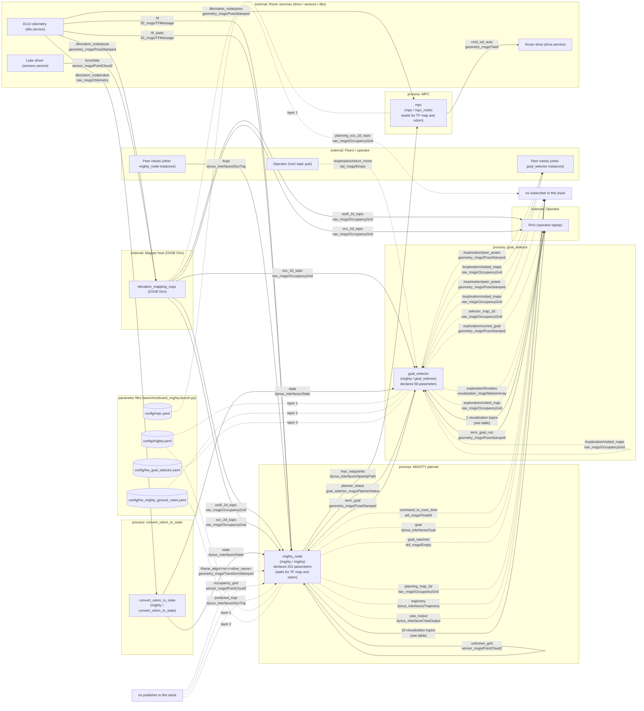

<!-- GENERATED FILE. DO NOT EDIT BY HAND. -->
<!-- Regenerate: python3 scripts/gen_architecture_diagram.py   (check: add --check) -->

# Goal selector architecture

> **Generated file, do not edit by hand.** Generated by `python3 scripts/gen_architecture_diagram.py` from the C++ sources, `launch/onboard_mighty.launch.py`, `docker/mighty_hw.sh`, `CMakeLists.txt` and `docs/external_nodes.yaml` (the only hand-maintained input). `--check` fails when this file is stale.

Scope: the hardware ground-robot stack started by `docker/mighty_hw.sh` (`use_hardware:=true`, `robot_type:=red_rover`). Code paths that the hardware parameters disable (for example the simulation-only map subscriptions) are listed in the table but not drawn.

Topic names: relative names (no leading `/`) resolve under the robot namespace, shown as `<ns>`; names with a leading `/` are global. Dashed edges are conditional (see the table notes); dotted edges from a file node are parameter YAML files, numbered in load order (later wins).

## Diagram

## Parameter files per process

| node | executable | sources scanned | parameter files in load order (later wins) | declared parameters |
|---|---|---|---|---|
| `mighty_node` | `mighty/mighty` | `src/mighty/mighty_node.cpp` `src/mighty/mighty.cpp` `src/hgp/hgp_manager.cpp` `src/hgp/utils.cpp` `src/hgp/hgp_planner.cpp` `src/hgp/graph_search.cpp` `src/mighty/utils.cpp` `src/mighty/lbfgs_solver.cpp` `src/mighty/lbfgs_solver_utils.cpp` `src/map2d/map2d.cpp` | 1. `mighty_ground_robot.yaml` (inactive on hardware) [use_ground_robot] 2. `mighty.yaml` [not (use_ground_robot)] 3. `hw_mighty_ground_robot.yaml` [use_hardware and robot_type in [RED_ROVER, STAR_ROBOT]] 4. `hw_mighty.yaml` (inactive on hardware) [use_hardware and not (robot_type in [RED_ROVER, STAR_ROBOT])] | 201 |
| `convert_odom_to_state` | `mighty/convert_odom_to_state` | `src/mighty/convert_odom_to_state.cpp` | none | 0 |
| `goal_selector` | `mighty/goal_selector` | `src/goal_selector/goal_selector_node.cpp` `src/goal_selector/goal_selector.cpp` `src/mighty/frontier_detector.cpp` `src/mighty/frontier_manager.cpp` `src/map2d/map2d.cpp` | 1. `mighty_ground_robot.yaml` (inactive on hardware) [use_ground_robot] 2. `mighty.yaml` [not (use_ground_robot)] 3. `hw_mighty_ground_robot.yaml` [use_hardware and robot_type in [RED_ROVER, STAR_ROBOT]] 4. `hw_mighty.yaml` (inactive on hardware) [use_hardware and not (robot_type in [RED_ROVER, STAR_ROBOT])] 5. `hw_goal_selector.yaml` [use_hardware] | 58 |
| `mpc` | `mpc/mpc_node` | (external code) | 1. `mpc.yaml` [use_hardware] 2. `mpc_sim.yaml` (inactive on hardware) [not (use_hardware)] | - |

`mighty_node`: 201 declared parameters; provided by file (any layer may override): `mighty.yaml` 182, `hw_mighty_ground_robot.yaml` 188; declared but in no active file (code default only): 6.

`goal_selector`: 58 declared parameters; provided by file (any layer may override): `mighty.yaml` 45, `hw_mighty_ground_robot.yaml` 5, `hw_goal_selector.yaml` 53; declared but in no active file (code default only): 1.

## Topics

| topic | message type | publisher(s) | subscriber(s) | QoS | source | notes |
|---|---|---|---|---|---|---|
| `/exploration/peer_poses` | `geometry_msgs/PoseStamped` | `goal_selector` `peers` | `goal_selector` `peers` | pub goal_selector: reliable, volatile, keep_last 10 pub peers: reliable, volatile, keep_last 10 sub goal_selector: reliable, volatile, keep_last 10 sub peers: reliable, volatile, keep_last 10 | `docs/external_nodes.yaml` `src/goal_selector/goal_selector_node.cpp:122` `src/goal_selector/goal_selector_node.cpp:123` | pub goal_selector only if `expl_enabled && expl_use_minpos` sub goal_selector only if `expl_enabled && expl_use_minpos` |
| `/exploration/return_home` | `std_msgs/Empty` | `operator` | `goal_selector` | pub operator: reliable, volatile, keep_last 1 sub goal_selector: reliable, volatile, keep_last 1 | `docs/external_nodes.yaml` `src/goal_selector/goal_selector_node.cpp:146` | operator entry unverified operator: one-shot trigger; no publisher exists in this repo (grep), so it is published by hand sub goal_selector only if `expl_enabled` |
| `/exploration/visited_maps` | `nav_msgs/OccupancyGrid` | `goal_selector` `peers` | `goal_selector` `peers` | pub goal_selector: reliable, volatile, keep_last 1 pub peers: reliable, volatile, keep_last 1 sub goal_selector: reliable, volatile, keep_last 1 sub peers: reliable, volatile, keep_last 1 | `docs/external_nodes.yaml` `src/goal_selector/goal_selector_node.cpp:131` `src/goal_selector/goal_selector_node.cpp:133` | pub goal_selector only if `expl_enabled && expl_use_minpos` sub goal_selector only if `expl_enabled && expl_use_minpos` |
| `/frame_align/<ns>/<other_name>` | `geometry_msgs/TransformStamped` | - | `mighty_node` | sub mighty_node: reliable, volatile, keep_last 10 | `src/mighty/mighty_node.cpp:208` | **no publisher in this stack** |
| `/tf` | `tf2_msgs/TFMessage` | `dlio` | `mighty_node` | pub dlio: unspecified sub mighty_node: tf2 default (via TransformListener) | `docs/external_nodes.yaml` `src/mighty/mighty_node.cpp:243` | dlio: tf map->odom (docker/README.hw.md:30) |
| `/tf_static` | `tf2_msgs/TFMessage` | `dlio` | `mighty_node` | pub dlio: unspecified sub mighty_node: tf2 default (via TransformListener) | `docs/external_nodes.yaml` `src/mighty/mighty_node.cpp:243` | dlio entry unverified dlio: base_link->lidar static TF is published by sensors.service (docker/mighty_hw.sh:37) |
| `/trajs` | `dynus_interfaces/DynTraj` | `mighty_node` `peer_planners` | `mighty_node` | pub mighty_node: reliable, volatile, keep_last 10 pub peer_planners: reliable, volatile, keep_last 10 sub mighty_node: reliable, volatile, keep_last 10 | `docs/external_nodes.yaml` `src/mighty/mighty_node.cpp:174` `src/mighty/mighty_node.cpp:186` |  |
| `actual_traj` | `visualization_msgs/MarkerArray` | `mighty_node` | - | pub mighty_node: best_effort, volatile, keep_last 1 | `src/mighty/mighty_node.cpp:148` | **no subscriber in this stack** |
| `cmd_vel_auto` | `geometry_msgs/Twist` | `mpc` | `drive` | pub mpc: reliable, volatile, keep_last 10 sub drive: unspecified | `docs/external_nodes.yaml` | drive entry unverified drive: the drive/mux code is not in this workspace; docker/README.hw.md:77 only says MPC publishes cmd_vel_auto mpc: hardware cmd_vel_topic (mpc.yaml:11); 'cmd_vel' in sim |
| `command_to_exec_time` | `std_msgs/Float64` | `mighty_node` | - | pub mighty_node: reliable, volatile, keep_last 10 | `src/mighty/mighty_node.cpp:183` | **no subscriber in this stack** |
| `corridor_yaw_target` | `visualization_msgs/Marker` | `mighty_node` | - | pub mighty_node: best_effort, volatile, keep_last 1 | `src/mighty/mighty_node.cpp:167` | **no subscriber in this stack** |
| `cp` | `visualization_msgs/MarkerArray` | `mighty_node` | - | pub mighty_node: best_effort, volatile, keep_last 1 | `src/mighty/mighty_node.cpp:150` | **no subscriber in this stack** |
| `dlio/odom_node/odom` | `nav_msgs/Odometry` | `dlio` | `convert_odom_to_state` | pub dlio: unspecified sub convert_odom_to_state: reliable, volatile, keep_last 10 | `docs/external_nodes.yaml` `src/mighty/convert_odom_to_state.cpp:5` | sub convert_odom_to_state remapped from `odom` by the launch file |
| `dlio/odom_node/pose` | `geometry_msgs/PoseStamped` | `dlio` | `mapper` `mpc` | pub dlio: unspecified sub mapper: unspecified sub mpc: reliable, volatile, keep_last 10 | `docs/external_nodes.yaml` | mapper entry unverified mapper: mapper pose input mpc: hardware pose_topic from mpc.yaml:9; the launch file overrides it to 'world' when use_onboard_localization is false; sim uses use_tf_pose (TF) instead |
| `dynamic_map_marker` | `visualization_msgs/MarkerArray` | `mighty_node` | - | pub mighty_node: best_effort, volatile, keep_last 1 | `src/mighty/mighty_node.cpp:107` | **no subscriber in this stack** |
| `dynamic_occupied_grid` | `sensor_msgs/PointCloud2` | `mighty_node` | - | pub mighty_node: best_effort, volatile, keep_last 1 | `src/mighty/mighty_node.cpp:103` | **no subscriber in this stack** |
| `esdf_2d_topic` | `nav_msgs/OccupancyGrid` | `mapper` | `mighty_node` `rviz` | pub mapper: best_effort, volatile sub mighty_node: best_effort, volatile, keep_last 5 sub rviz: reliable, volatile, keep_last 5 | `docs/external_nodes.yaml` `src/mighty/mighty_node.cpp:290` | QoS WARNING (mapper -> rviz): subscriber reliable, publisher best_effort: no delivery mapper: encoded 2D ESDF; consumed by the planner when use_esdf_cost rviz: rviz/mighty_RR04.rviz:744, Map display 'RR04 2D ESDF' |
| `exploration/current_goal` | `geometry_msgs/PoseStamped` | `goal_selector` | `rviz` | pub goal_selector: reliable, volatile, keep_last 10 sub rviz: reliable, volatile, keep_last 5 | `docs/external_nodes.yaml` `src/goal_selector/goal_selector_node.cpp:92` | pub goal_selector only if `expl_enabled` rviz: rviz/mighty_RR04.rviz:783 (display disabled in the shipped config) |
| `exploration/frontiers` | `visualization_msgs/MarkerArray` | `goal_selector` | `rviz` | pub goal_selector: reliable, volatile, keep_last 10 sub rviz: reliable, volatile, keep_last 5 | `docs/external_nodes.yaml` `src/goal_selector/goal_selector_node.cpp:90` | pub goal_selector only if `expl_enabled` rviz: rviz/mighty_RR04.rviz:763 |
| `exploration/visited_map` | `nav_msgs/OccupancyGrid` | `goal_selector` | `rviz` | pub goal_selector: reliable, transient_local, keep_last 1 sub rviz: reliable, transient_local, keep_last 1 | `docs/external_nodes.yaml` `src/goal_selector/goal_selector_node.cpp:93` | pub goal_selector only if `expl_enabled` rviz: rviz/mighty_RR04.rviz:634 |
| `fov` | `visualization_msgs/Marker` | `mighty_node` | - | pub mighty_node: best_effort, volatile, keep_last 1 | `src/mighty/mighty_node.cpp:149` | **no subscriber in this stack** |
| `free_grid` | `sensor_msgs/PointCloud2` | `mighty_node` | - | pub mighty_node: best_effort, volatile, keep_last 1 | `src/mighty/mighty_node.cpp:123` | **no subscriber in this stack** |
| `free_hgp_path_marker` | `visualization_msgs/MarkerArray` | `mighty_node` | - | pub mighty_node: best_effort, volatile, keep_last 1 | `src/mighty/mighty_node.cpp:131` | **no subscriber in this stack** |
| `free_map_marker` | `visualization_msgs/MarkerArray` | `mighty_node` | - | pub mighty_node: best_effort, volatile, keep_last 1 | `src/mighty/mighty_node.cpp:109` | **no subscriber in this stack** |
| `goal` | `dynus_interfaces/Goal` | `mighty_node` | - | pub mighty_node: reliable, volatile, keep_last 10 | `src/mighty/mighty_node.cpp:175` | **no subscriber in this stack** |
| `goal_reached` | `std_msgs/Empty` | `mighty_node` | - | pub mighty_node: reliable, volatile, keep_last 10 | `src/mighty/mighty_node.cpp:179` | **no subscriber in this stack** |
| `ground_2d_heat` | `sensor_msgs/PointCloud2` | `mighty_node` | - | pub mighty_node: best_effort, volatile, keep_last 1 | `src/mighty/mighty_node.cpp:121` | **no subscriber in this stack** |
| `ground_2d_occupied` | `sensor_msgs/PointCloud2` | `mighty_node` | - | pub mighty_node: best_effort, volatile, keep_last 1 | `src/mighty/mighty_node.cpp:115` | **no subscriber in this stack** |
| `heat_cloud` | `sensor_msgs/PointCloud2` | `mighty_node` | - | pub mighty_node: best_effort, volatile, keep_last 1 | `src/mighty/mighty_node.cpp:114` | **no subscriber in this stack** |
| `hgp_path_marker` | `visualization_msgs/MarkerArray` | `mighty_node` | - | pub mighty_node: best_effort, volatile, keep_last 1 | `src/mighty/mighty_node.cpp:127` | **no subscriber in this stack** |
| `livox/lidar` | `sensor_msgs/PointCloud2` | `sensors` | `mapper` | pub sensors: unspecified sub mapper: unspecified | `docs/external_nodes.yaml` | mapper entry unverified mapper: mapper input; sensors.service publishes it (docker/mighty_hw.sh:37); the mapper's own code is not in this workspace sensors entry unverified sensors: driver code not in this workspace; docker/mighty_hw.sh:37 and the launch remap lidar_cloud_in -> livox/lidar name the topic |
| `local_global_path_after_push_marker` | `visualization_msgs/MarkerArray` | `mighty_node` | - | pub mighty_node: best_effort, volatile, keep_last 1 | `src/mighty/mighty_node.cpp:136` | **no subscriber in this stack** |
| `local_global_path_marker` | `visualization_msgs/MarkerArray` | `mighty_node` | - | pub mighty_node: best_effort, volatile, keep_last 1 | `src/mighty/mighty_node.cpp:133` | **no subscriber in this stack** |
| `mpc_waypoints` | `dynus_interfaces/SpeedyPath` | `mighty_node` | `mpc` | pub mighty_node: reliable, volatile, keep_last 10 sub mpc: reliable, volatile, keep_last 10 | `docs/external_nodes.yaml` `src/mighty/mighty_node.cpp:178` | mpc: mpc_node.py:231 (path_topic parameter) |
| `occ_2d_topic` | `nav_msgs/OccupancyGrid` | `mapper` | `mighty_node` `goal_selector` `rviz` | pub mapper: best_effort, volatile sub mighty_node: best_effort, volatile, keep_last 5 sub goal_selector: best_effort, volatile, keep_last 5 sub rviz: reliable, volatile, keep_last 5 | `docs/external_nodes.yaml` `src/goal_selector/goal_selector_node.cpp:109` `src/mighty/mighty_node.cpp:299` | QoS WARNING (mapper -> rviz): subscriber reliable, publisher best_effort: no delivery mapper: raw tri-state 2D grid; consumed by planner and selector since Phase 5 rviz: rviz/mighty_RR04.rviz:655, Map display 'RR04 2D Occ from ACL Mapper' |
| `occupancy_grid` | `sensor_msgs/PointCloud2` | - | `mighty_node` `mighty_node` (sim only) | sub mighty_node: reliable, volatile, keep_last 5 (from_rmw copies only history+depth; reliability/durability stay default) sub mighty_node: best_effort, volatile, keep_last 5 | `src/mighty/mighty_node.cpp:260` `src/mighty/mighty_node.cpp:272` | **no publisher in this stack** sub mighty_node inactive on hardware (not drawn): `!use_hardware && sim_env != "fake_sim"` |
| `original_hgp_path_marker` | `visualization_msgs/MarkerArray` | `mighty_node` | - | pub mighty_node: best_effort, volatile, keep_last 1 | `src/mighty/mighty_node.cpp:129` | **no subscriber in this stack** |
| `p_points` | `visualization_msgs/MarkerArray` | `mighty_node` | - | pub mighty_node: best_effort, volatile, keep_last 1 | `src/mighty/mighty_node.cpp:153` | **no subscriber in this stack** |
| `planner_status` | `goal_selector_msgs/PlannerStatus` | `mighty_node` | `goal_selector` | pub mighty_node: reliable, volatile, keep_last 10 sub goal_selector: reliable, volatile, keep_last 10 | `src/goal_selector/goal_selector_node.cpp:104` `src/mighty/mighty_node.cpp:181` |  |
| `planning_map_2d` | `nav_msgs/OccupancyGrid` | `mighty_node` | - | pub mighty_node: reliable, transient_local, keep_last 1 | `src/mighty/mighty_node.cpp:119` | **no subscriber in this stack** |
| `planning_occ_2d_topic` | `nav_msgs/OccupancyGrid` | `mapper` | - | pub mapper: best_effort, volatile | `docs/external_nodes.yaml` | **no subscriber in this stack** mapper entry unverified mapper: PUBLISHED BUT UNUSED: nothing subscribes since Phase 5 (recorded by pass1_rover.sh only); producer is not in this workspace |
| `point_A` | `geometry_msgs/PointStamped` | `mighty_node` | - | pub mighty_node: best_effort, volatile, keep_last 1 | `src/mighty/mighty_node.cpp:155` | **no subscriber in this stack** |
| `point_E` | `geometry_msgs/PointStamped` | `mighty_node` | - | pub mighty_node: best_effort, volatile, keep_last 1 | `src/mighty/mighty_node.cpp:157` | **no subscriber in this stack** |
| `point_G` | `geometry_msgs/PointStamped` | `mighty_node` | - | pub mighty_node: best_effort, volatile, keep_last 1 | `src/mighty/mighty_node.cpp:156` | **no subscriber in this stack** |
| `point_G_term` | `geometry_msgs/PointStamped` | `mighty_node` | - | pub mighty_node: best_effort, volatile, keep_last 1 | `src/mighty/mighty_node.cpp:158` | **no subscriber in this stack** |
| `point_current_state` | `geometry_msgs/PointStamped` | `mighty_node` | - | pub mighty_node: best_effort, volatile, keep_last 1 | `src/mighty/mighty_node.cpp:160` | **no subscriber in this stack** |
| `point_selector_goal` | `geometry_msgs/PointStamped` | `goal_selector` | - | pub goal_selector: best_effort, volatile, keep_last 1 | `src/goal_selector/goal_selector_node.cpp:87` | **no subscriber in this stack** |
| `poly_safe` | `decomp_ros_msgs/PolyhedronArray` | `mighty_node` | - | pub mighty_node: best_effort, volatile, keep_last 1 | `src/mighty/mighty_node.cpp:140` | **no subscriber in this stack** |
| `poly_whole` | `decomp_ros_msgs/PolyhedronArray` | `mighty_node` | - | pub mighty_node: best_effort, volatile, keep_last 1 | `src/mighty/mighty_node.cpp:138` | **no subscriber in this stack** |
| `predicted_trajs` | `dynus_interfaces/DynTraj` | - | `mighty_node` | sub mighty_node: reliable, volatile, keep_last 10 | `src/mighty/mighty_node.cpp:189` | **no publisher in this stack** |
| `selector_map_2d` | `nav_msgs/OccupancyGrid` | `goal_selector` | - | pub goal_selector: reliable, transient_local, keep_last 1 | `src/goal_selector/goal_selector_node.cpp:82` | **no subscriber in this stack** |
| `sensor_point_cloud` | `sensor_msgs/PointCloud2` | - | `mighty_node` (sim only) | sub mighty_node: reliable, volatile, keep_last 5 (from_rmw copies only history+depth; reliability/durability stay default) | `src/mighty/mighty_node.cpp:278` | **no publisher in this stack** sub mighty_node inactive on hardware (not drawn): `!use_hardware && !(sim_env != "fake_sim")` |
| `setpoint_vis` | `geometry_msgs/PointStamped` | `mighty_node` | - | pub mighty_node: best_effort, volatile, keep_last 1 | `src/mighty/mighty_node.cpp:146` | **no subscriber in this stack** |
| `state` | `dynus_interfaces/State` | `convert_odom_to_state` | `mighty_node` `goal_selector` | pub convert_odom_to_state: reliable, volatile, keep_last 1 sub mighty_node: reliable, volatile, keep_last 10 sub goal_selector: reliable, volatile, keep_last 10 | `src/goal_selector/goal_selector_node.cpp:98` `src/mighty/convert_odom_to_state.cpp:12` `src/mighty/mighty_node.cpp:192` |  |
| `static_map_marker` | `visualization_msgs/MarkerArray` | `mighty_node` | - | pub mighty_node: best_effort, volatile, keep_last 1 | `src/mighty/mighty_node.cpp:105` | **no subscriber in this stack** |
| `static_push_points` | `visualization_msgs/MarkerArray` | `mighty_node` | - | pub mighty_node: best_effort, volatile, keep_last 1 | `src/mighty/mighty_node.cpp:151` | **no subscriber in this stack** |
| `term_goal` | `geometry_msgs/PoseStamped` | `goal_selector` | `mighty_node` | pub goal_selector: reliable, volatile, keep_last 10 sub mighty_node: reliable, volatile, keep_last 10 | `src/goal_selector/goal_selector_node.cpp:80` `src/mighty/mighty_node.cpp:195` |  |
| `term_goal_rviz` | `geometry_msgs/PoseStamped` | `rviz` | `goal_selector` | pub rviz: reliable, volatile, keep_last 5 sub goal_selector: reliable, volatile, keep_last 10 | `docs/external_nodes.yaml` `src/goal_selector/goal_selector_node.cpp:101` | rviz: 2D Goal Pose tool, RR04/RR05/RR06 configs (rviz/mighty_RR04.rviz:907-913). UAV (mighty_PX03.rviz) and sim configs publish to term_goal directly (spec section 13) |
| `traj_committed_colored` | `visualization_msgs/MarkerArray` | `mighty_node` | - | pub mighty_node: best_effort, volatile, keep_last 1 | `src/mighty/mighty_node.cpp:142` | **no subscriber in this stack** |
| `traj_received` | `visualization_msgs/Marker` | `mighty_node` | - | pub mighty_node: best_effort, volatile, keep_last 1 | `src/mighty/mighty_node.cpp:163` | **no subscriber in this stack** |
| `traj_subopt_colored` | `visualization_msgs/MarkerArray` | `mighty_node` | - | pub mighty_node: best_effort, volatile, keep_last 1 | `src/mighty/mighty_node.cpp:144` | **no subscriber in this stack** |
| `traj_transformed` | `visualization_msgs/Marker` | `mighty_node` | - | pub mighty_node: best_effort, volatile, keep_last 1 | `src/mighty/mighty_node.cpp:165` | **no subscriber in this stack** |
| `trajectory` | `dynus_interfaces/Trajectory` | `mighty_node` | - | pub mighty_node: reliable, volatile, keep_last 10 | `src/mighty/mighty_node.cpp:177` | **no subscriber in this stack** |
| `unknown_grid` | `sensor_msgs/PointCloud2` | `mighty_node` | `mighty_node` `mighty_node` (sim only) | pub mighty_node: best_effort, volatile, keep_last 1 sub mighty_node: reliable, volatile, keep_last 5 (from_rmw copies only history+depth; reliability/durability stay default) sub mighty_node: best_effort, volatile, keep_last 5 | `src/mighty/mighty_node.cpp:125` `src/mighty/mighty_node.cpp:264` `src/mighty/mighty_node.cpp:273` | QoS WARNING (mighty_node -> mighty_node): subscriber reliable, publisher best_effort: no delivery sub mighty_node inactive on hardware (not drawn): `!use_hardware && sim_env != "fake_sim"` |
| `unknown_map_marker` | `visualization_msgs/MarkerArray` | `mighty_node` | - | pub mighty_node: best_effort, volatile, keep_last 1 | `src/mighty/mighty_node.cpp:111` | **no subscriber in this stack** |
| `vel_text` | `visualization_msgs/Marker` | `mighty_node` | - | pub mighty_node: best_effort, volatile, keep_last 1 | `src/mighty/mighty_node.cpp:162` | **no subscriber in this stack** |
| `yaw_output` | `dynus_interfaces/YawOutput` | `mighty_node` | - | pub mighty_node: reliable, volatile, keep_last 10 | `src/mighty/mighty_node.cpp:171` | **no subscriber in this stack** |

## Services and clients

None: no `create_client` / `create_service` call exists in the scanned sources.

## Findings of the cross-check

- topic `esdf_2d_topic`: mapper -> rviz: subscriber reliable, publisher best_effort: no delivery
- topic `occ_2d_topic`: mapper -> rviz: subscriber reliable, publisher best_effort: no delivery
- topic `unknown_grid`: mighty_node -> mighty_node: subscriber reliable, publisher best_effort: no delivery

Published but with no subscriber in this stack (collapsed visualization topics excluded): `command_to_exec_time`, `goal`, `goal_reached`, `planning_map_2d`, `planning_occ_2d_topic`, `selector_map_2d`, `trajectory`, `yaw_output`.

Subscribed (on hardware) but with no publisher in this stack: `/frame_align/<ns>/<other_name>`, `occupancy_grid`, `predicted_trajs`.

Launch remappings that do not match any topic the node creates (dead remaps):

- `mighty_node`: `lidar_cloud_in` -> `livox/lidar`
- `mighty_node`: `depth_camera_cloud_in` -> `d455/depth/color/points`

## How this is generated, and its limits

- Which processes exist comes from the pane commands in `docker/mighty_hw.sh` (`only_nodes:=...`); each name is looked up among the `Node(...)` actions of the launch file (parsed with `ast`).
- The sources of each in-package executable come from `CMakeLists.txt` (`add_executable`, `add_library`, `target_link_libraries`). `create_publisher`, `create_subscription`, `create_client`, `create_service` and `message_filters` `subscribe` calls are found by text scanning of the comment-stripped source, including multi-line calls and template arguments.
- Topic names: string literals, adjacent literals, and local `std::string` variables built by `+` are resolved; any other term is printed as `<expr>` (the namespace member `ns_` becomes `<ns>`).
- QoS: integers, `rclcpp::QoS(...)` chains, `SensorDataQoS`, `rmw_qos_profile_sensor_data` and local `rclcpp::QoS` variables with later mutator calls are evaluated; anything else is printed as `unresolved: <expr>`. Default QoS profile means reliable, volatile.
- Conditions: enclosing `if` / `else if` / `else` chains and early-`return` guards in the same function are recorded. Atoms over `use_hardware`, `vehicle_type` and scalar parameters from the active YAML files are evaluated; calls whose condition is false on hardware are not drawn. Conditions that depend on run-time state stay in the notes.
- Not seen by the parser: publishers/subscribers created through helper functions or wrappers, `image_transport`, dynamically constructed topic names beyond simple `+` concatenation, and ROS parameter overrides of topic names. TF use is added from `tf2_ros::TransformListener` / broadcaster declarations.
- Parameter files: Python data-flow through variables in `launch_setup`; launch conditions are evaluated with the launch arguments in the `launch_base` of `docker/mighty_hw.sh`.
- External nodes (and their QoS) are whatever `docs/external_nodes.yaml` says; entries marked `unverified` there are flagged in the table.
